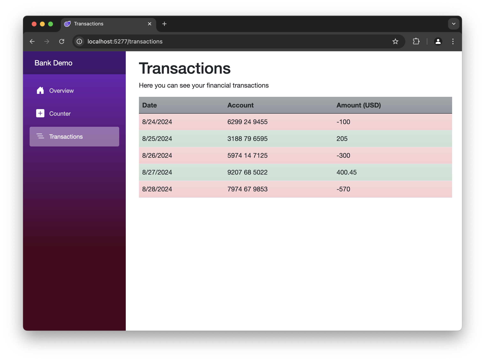

# Bank System

[](https://github.com/larsjuvik/BankSystem/actions/workflows/CI.yml)

This is a demo of a bank system, written in Blazor Web App, with .NET 8.



## Building the application

### Building release version

```sh
dotnet publish -c Release
```

### Running the application

```sh
dotnet run --project WebApp
```

### Building and running with Docker

```sh
docker build -t bank-system .
docker run --name bank-system -d -p 8080:8080 bank-system
```

## Attributions

Thank you to the following libraries and frameworks :heart:

- [Blazor](https://dotnet.microsoft.com/en-us/apps/aspnet/web-apps/blazor)
- [Bootstrap](https://getbootstrap.com)
- [Bootstrap Icons](https://icons.getbootstrap.com)
- [AutoMapper](https://github.com/AutoMapper/AutoMapper)
