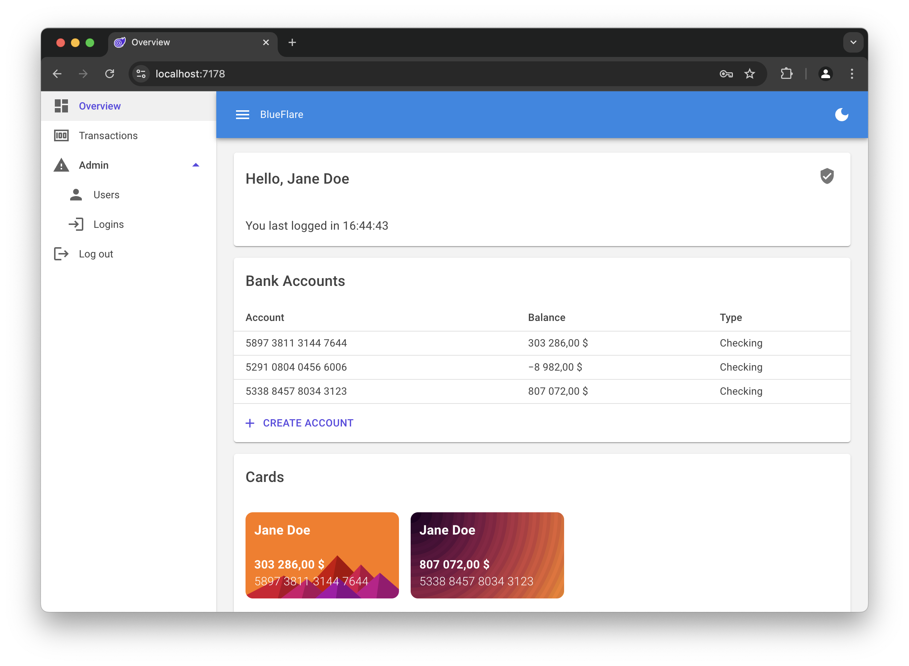

# Bank System

[](https://github.com/larsjuvik/BankSystem/actions/workflows/CI.yml)

**This project is a demo still under development, and should not be considered production-ready.**

This is a demo of a (fictional) bank system called BlueFlare, written in Blazor Web App, with .NET 9.


All data in the screenshot are fictional.

## Building the application

### Building release version

```sh
dotnet publish -c Release
```

### Running the application

```sh
dotnet run --project WebApp
```

### Building and running with Docker

```sh
docker build -t bank-system .
docker run --name bank-system -d -p 8080:8080 bank-system
```

### Notes

This application will only function correctly over `https`. If this is not desirable, change the
`options.Cookie.SecurePolicy` to your liking.

## Goals and nice-to-have's

- [ ] A data table for Admins to manage users
- [ ] A home page for users, where they can add bank accounts
- [ ] A transactions page, where users can see transactions from a specific account
- [ ] Sliding cookie expiration within SignalR-connection

## Attributions

Thank you to the following libraries and frameworks :heart:

- [Blazor](https://dotnet.microsoft.com/en-us/apps/aspnet/web-apps/blazor)
- [MudBlazor](https://mudblazor.com)
- [AutoMapper](https://github.com/AutoMapper/AutoMapper)
